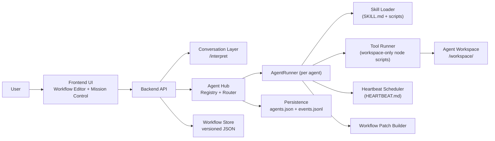
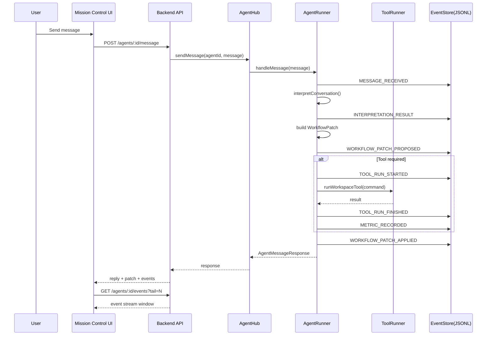

# Architecture Summary

## System Components

- Frontend (`React + TypeScript + Vite`)
  - Workflow Editor: React Flow graph visualization and manual editing
  - Mission Control: agent list, skills, chat, events
- Backend (`Node.js + TypeScript + Express`)
  - Conversation Layer: interprets chat into structured tasks
  - Agent Hub: registry, per-agent runners, skill loading, heartbeat scheduler
  - LLM Router Admin: rules, budgets, usage ledger, metrics
  - Fleet Manager: tenant/cloud/node/agent provisioning metadata + SSH/local bootstrap
  - Execution Layer: workspace-restricted Node tool runner
  - Workflow Layer: JSON versioned workflow persistence
- Workspace & File Persistence
  - `workspace/<agentId>`: config, heartbeat, skills, inputs/outputs, local state
  - `backend/data/agents.json`: registry
  - `backend/data/agents/<agentId>/events.jsonl`: event stream storage
  - `backend/data/llm-router/usage.jsonl`: LLM usage ledger
  - `backend/data/tenants.json`, `clouds.json`, `nodes.json`, `agents.json`: fleet objects

## End-to-End Data Flow

1. User sends chat message from Mission Control to a selected agent.
2. AgentRunner emits `MESSAGE_RECEIVED` and runs interpreter.
3. Interpreter returns task suggestions; AgentRunner emits `INTERPRETATION_RESULT`.
4. AgentRunner builds a versioned `WorkflowPatch` proposal and emits `WORKFLOW_PATCH_PROPOSED`.
5. Agent decides whether to run tools (skills) and emits `TOOL_RUN_STARTED` / `TOOL_RUN_FINISHED`.
6. Agent emits metrics and heartbeat ticks when relevant (`METRIC_RECORDED`, `HEARTBEAT_TICK`).
7. Patch is marked applied in session (`WORKFLOW_PATCH_APPLIED`) and returned to UI.
8. UI polls events and renders logs + patch/tool outcomes.

## Directory Structure

```text
/Users/monotributistar/SOURCES/Talkative /
  backend/
    src/
      agents/
        agentRegistry.ts
        agentHub.ts
        agentRunner.ts
        toolRunner.ts
        workflowPatch.ts
        eventStore.ts
        skillLoader.ts
        types.ts
      routes/
        agentRoutes.ts
        workflowRoutes.ts
        conversationRoutes.ts
      services/
        interpreter.ts
        workflowStore.ts
    data/
      agents.json
      agents/<agentId>/events.jsonl
  frontend/
    src/
      MissionControl.tsx
      WorkflowEditor.tsx
      api.ts
      types.ts
  skills/
    templates/
      mail-triage/
      git-watcher/
      monthly-bookkeeping/
  workspace/
    <agentId>/
      config.json
      HEARTBEAT.md
      skills/
      inputs/
      outputs/
```

## Why This Design

- Workspace-first keeps each agent isolated, inspectable, and portable.
- Skills with progressive disclosure keep startup lightweight while allowing richer behavior on demand.
- Separating conversation, workflow model, and deterministic execution improves trust and debuggability.
- JSON + JSONL persistence makes the POC easy to run locally while preserving migration paths.
- `AgentRunner` interface is process-boundary friendly, so future multi-process / multi-agent scale-up is straightforward.

## Component Diagram



## Message Flow Diagram


